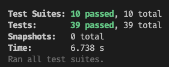
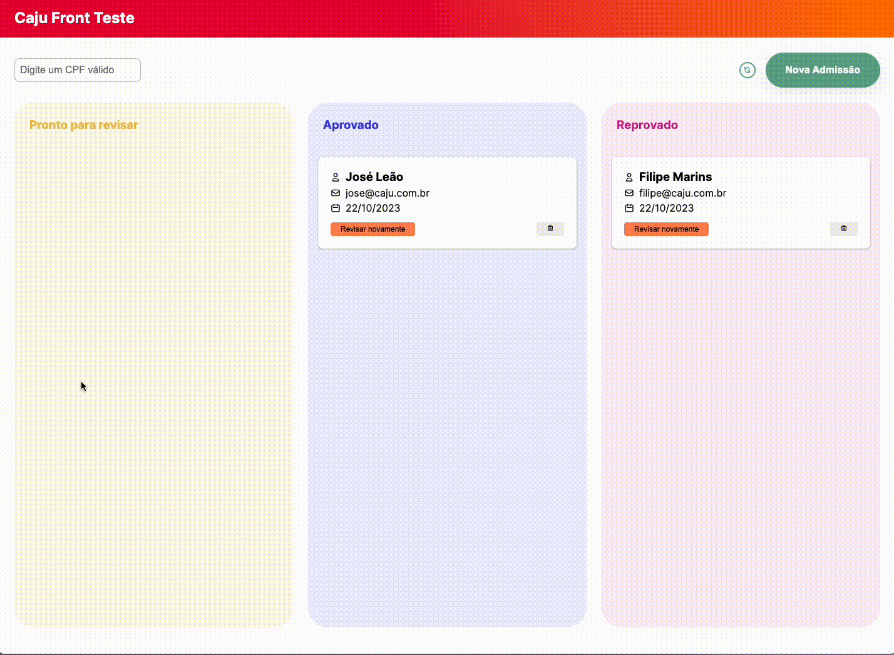

# Caju Front End Teste

Olá! você pode visualizar tanto a documentação quanto o proprio app, porém por estar utilizando o json-server, será necessário rodar o projeto localmente nesse momento.

## Libs utilizadas
- React Query | para lidar com estado assincrono das requisições ao servidor
- Axios | interface para lidar com as requisições externas
- React Hook Form | para trabalhar com os formularios disponiveis
- Zod | para fazer as regras e transformações do conteudo relacionado aos formulários
- React Hot Toast | utilizado para fazer avisos relacionado a sucesso e erro, também utilizado para modais de modificação
- msw | para criar servidores para os testes unitarios e integração
- storybook | para documentação visual dos componentes disponiveis no projeto

## Storybook
Pode acessar [aqui](https://starlit-chaja-1ef679.netlify.app/)

Ele está dividido no mesmo sistema do aplicativo, com os componentes básicos, componentes especificos ao dashboard e as páginas Dashboard e NewUser.

## App
Pode acessar [aqui](https://luxury-swan-7a534e.netlify.app/#/dashboard)

Para rodar o conteúdo do servidor, é necessario instalar o projeto e rodando o `yarn init:db`, assim será possivel ver o conteúdo em tela.

## Testes
Atualmente com cobertura de 97% do projeto, os testes unitários foram feitos com jest e react-testing-library

## Situações

Abaixo, temos GIFs das ações geradas dentro do aplicativo e os seus acontecimentos.

### Dashboard | Ações de Cards

### Dashboard | Busca CPF

### Formulário | Adicionando registro

### Formulário | Cenários de erro

